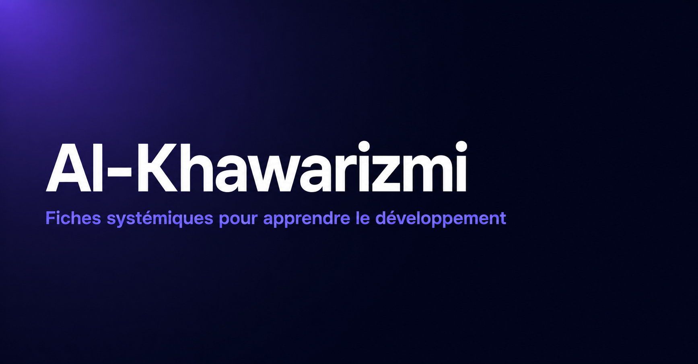

# Alkhawarizmi

[](https://github.com/AmineAKIK/alkhawarizmi/actions/workflows/ci.yml)
[](https://github.com/AmineAKIK/alkhawarizmi/actions/workflows/deploy-pages.yml)
[](LICENSE)

**[Voir la démo en ligne →](https://amineakik.github.io/alkhawarizmi/)**

Alkhawarizmi est un catalogue de fiches pédagogiques systémiques pour apprendre le développement logiciel comme un raisonnement complet, pas comme une collection de recettes.



## Pourquoi ce projet

La plupart des ressources d'apprentissage en dev listent des recettes techniques sans expliquer pourquoi elles existent ni où elles se situent dans le système global. Alkhawarizmi part de l'inverse : chaque fiche est une carte navigable qui relie un concept à son contexte, ses alternatives et ses erreurs classiques, pour construire une compréhension durable plutôt qu'une mémorisation de commandes.

Chaque fiche transforme un sujet en carte navigable :

- pourquoi le concept existe ;
- où il se place dans le système ;
- quels choix conscients faire ;
- ce qu'une personne expérimentée anticipe ;
- quelles erreurs classiques éviter ;
- quels invariants retenir ;
- quoi pratiquer ;
- comment vérifier sa compréhension.

## Documentation

- [Documentation conceptuelle](docs/conceptuelle.md)
- [Documentation technique](docs/technique.md)
- [Guide de contribution aux fiches](docs/contribution-fiches.md)
- [Guide de contribution technique](CONTRIBUTING.md)

## Prérequis

- Node.js 22.22.2 ou plus récent (`.nvmrc` fournit la version de référence)
- npm avec support de `npm ci`

Avec nvm :

```bash
nvm use
```

## Démarrage

```bash
npm install
npm run dev
```

Build de production :

```bash
npm run build
```

Prévisualisation du build :

```bash
npm run preview
```

Quality gate local complet :

```bash
npm run check
```

Cette commande exécute le lint sans warnings tolérés, le contrôle Prettier, les tests avec couverture et le build TypeScript/Vite. Les commandes restent aussi disponibles séparément :

```bash
npm run lint
npm run format:check
npm run typecheck
npm test
npm run test:coverage
```

## Stack

- React 19
- TypeScript
- Vite
- Vitest + Testing Library
- vite-plugin-pwa
- lucide-react

## Structure rapide

```text
src/
  data/
    schema.ts             Types du modèle de fiches
    catalog.ts            Catalogue, catégories, normalisation, routes
    presentation.ts       Couleurs, labels, textes partagés de rendu
    sheets/               Contenu pédagogique
  audio/
    useSpeechReader.ts     Hook de lecture audio (Web Speech API)
    readableContent.ts     Extraction du texte lisible d'une fiche
  ui/
    App.tsx                Routage client et pages catalogue
    routing.ts             Résolution centralisée des URLs internes
    SheetView.tsx          Orchestration du rendu d'une fiche
    components/
      SystemMap.tsx        Carte SVG systémique + liste mobile
      NodePanel.tsx        Panneau de détail d'un nœud
      AudioPlayerBar.tsx   Barre de contrôle du lecteur audio
      PositioningBand.tsx  Bandeau d'intro repliable
  styles/
    global.css             Design system CSS de l'application
    fonts.css              Polices auto-hébergées (Syne, JetBrains Mono)
```

L'application est une SPA statique : toutes les données sont locales au dépôt, sans backend.

## Licence

Alkhawarizmi utilise un modèle de licence séparant le logiciel et le contenu pédagogique :

- **Code source original du projet** : [PolyForm Noncommercial 1.0.0](LICENSE). Le code peut être étudié, modifié et redistribué dans le cadre des usages non commerciaux autorisés par cette licence.
- **Contenu pédagogique** de `src/data/sheets/**` : [CC BY-NC-SA 4.0](CONTENT_LICENSE.md). Le partage et l’adaptation non commerciaux sont autorisés avec attribution et partage dans les mêmes conditions.
- **Usage commercial** : aucun droit commercial supplémentaire n’est accordé automatiquement. Voir [COMMERCIAL_LICENSE.md](COMMERCIAL_LICENSE.md) pour la politique de licence commerciale et le contact.
- **Composants tiers** : ils conservent leurs licences respectives. Voir [THIRD_PARTY_NOTICES.md](THIRD_PARTY_NOTICES.md), notamment pour les polices auto-hébergées.

Ce dépôt est donc **source available avec des droits non commerciaux**, et non « open source » au sens de l’Open Source Definition.
